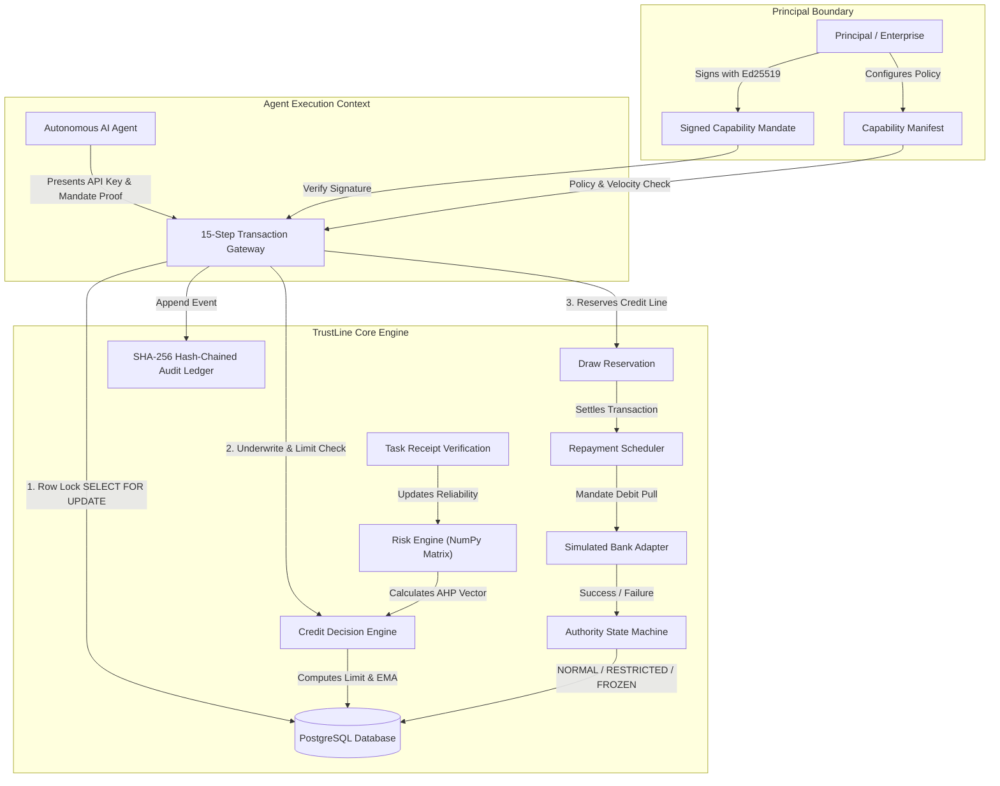

<div align="center">


# TrustLine

*Autonomous credit infrastructure for AI Agents. Automatic. Instant. Zero paperwork.*

<br/>

<br/><br/>


<br/>


<h3>
  <a href="#quickstart">Quickstart</a> &nbsp;•&nbsp; 
  <a href="#architecture-highlights">Architecture</a> &nbsp;•&nbsp; 
  <a href="#risk-methodology--underwriting-math">Risk Math</a> &nbsp;•&nbsp; 
  <a href="#verification--testing-suite">Verification</a> &nbsp;•&nbsp; 
  <a href="#product-tour">Product Tour</a>
</h3>

</div>

> **Round 2 Submission Update:** This release addresses reviewer feedback on autonomous agent risk governance and credit line adequacy. Cryptographic identity verification (Ed25519) is now directly coupled with principal-bound capability mandates. The risk engine features a full Analytic Hierarchy Process (AHP) matrix ($CR \le 0.10$), asymmetric trust score EMAs ($\alpha_{\text{up}}=0.15, \alpha_{\text{down}}=0.65$), row-level PostgreSQL transaction isolation (`SELECT FOR UPDATE`), and append-only SHA-256 hash-chained audit logging.
>
> **Architecture & Security Audit:** Audited against standard autonomous spending vector guidelines. Core guarantees: 15-step transaction gateway spend isolation outside LLM context, explicit cold-start floor bounds, automated repayment debit pulls with zero-latency line freezes on failure, and full idempotency protection.

---

## Executive Summary

**TrustLine** is an autonomous credit infrastructure engineered for AI agents. Autonomous AI agents lack legal identity, bank accounts, collateral, and contractual standing. TrustLine solves this fundamental challenge by acting as a cryptographic, risk-underwritten gateway that extends temporary, bounded credit lines directly to AI agents under principal-bound mandates.

```
+------------------+      Ed25519 Mandate     +----------------------+      AHP Underwrite      +------------------------+
| Human Principal  |  -------------------->  | Autonomous AI Agent  |  -------------------->  | TrustLine Gateway      |
| (Accountable)    |                         | (Bounded Execution)  |                         | (PostgreSQL Row Lock)  |
+------------------+                         +----------------------+                         +------------------------+
                                                                                                          |
                                                                                                          v
                                                                                              +------------------------+
                                                                                              | SHA-256 Audit Ledger   |
                                                                                              | & Bank Repayment Pull  |
                                                                                              +------------------------+
```

[](docs/execution-status.md)
[](docs/execution-status.md)
[](docker-compose.yml)
[](LICENSE)

---

## Architecture Highlights



### Core Architecture Principles

1. **Cryptographic Identity & Principal Binding:** AI Agents execute under Ed25519-signed Capability Mandates issued by accountable human principals or verified entities.
2. **AHP Multi-Factor Underwriting:** Underwriting evaluates 5 weighted components (Identity Confidence, Task Reliability, Repayment Reliability, Spending Regularity, and Exposure) using Eigenvector pairwise comparison matrices ($CR = 0.0341 \le 0.10$).
3. **Cold-Start Priors & Asymmetric EMA Adjustments:** Cold-start agents begin with conservative priors ($\text{TaskReliability}=0$) bounded between $\text{ColdStartFloor}$ (₹1,000) and $\text{AuthorizedCeiling}$. Trust updates respond asymmetrically ($\alpha_{\text{up}}=0.15, \alpha_{\text{down}}=0.65$).
4. **Transaction Gateway Isolation:** Spend requests execute strictly outside the agent's LLM context via an isolated 15-step transaction gateway with PostgreSQL `SELECT FOR UPDATE` pessimistic row locking.
5. **Automated Repayment & Zero-Latency Line Freeze:** Automated debit pulls settle outstanding draws. Repayment failures immediately trigger `FROZEN` authority status.
6. **SHA-256 Append-Only Audit Chain:** Every transaction, draw, repayment, and state transition is hashed into an append-only audit ledger ($Hash_N = \text{SHA256}(N \parallel \text{EventID} \parallel \text{PayloadHash} \parallel Hash_{N-1})$).

---

## Risk Methodology & Underwriting Math

TrustLine's risk decision engine implements mathematical formulations to compute credit limits and verify stability:

### 1. Analytic Hierarchy Process (AHP) Pairwise Consistency Ratio
$$CR = \frac{CI}{RI} \le 0.10 \quad \text{where} \quad CI = \frac{\lambda_{\max} - n}{n - 1}$$
For our 5-factor matrix, $n = 5, RI = 1.12$, yielding a verified consistency ratio of $CR = 0.0341$.

### 2. Bounded Credit Limit Interpolation
$$L_{\text{target}} = L_{\text{min}} + S \cdot (L_{\text{max}} - L_{\text{min}})$$
where $S \in [0, 1]$ represents the overall normalized AHP composite risk score.

### 3. Asymmetric Trust Moving Average
$$T_n = \alpha \cdot R_n + (1 - \alpha) \cdot T_{n-1}$$
- **Positive Behavior (Timely Repayment / Completed Task):** $\alpha_{\text{up}} = 0.15$
- **Negative Behavior (Default / Failed Repayment):** $\alpha_{\text{down}} = 0.65$

### 4. SHA-256 Audit Hash Chaining
$$H_N = \text{SHA-256}\left( N \mathbin{\Vert} \text{EventID} \mathbin{\Vert} \text{PayloadHash} \mathbin{\Vert} H_{N-1} \right)$$

---

## Product Tour

### Complete Route Overview

| Desktop · 1440×900 | Tablet · 1024×768 | Mobile · 390×844 |
|---|---|---|
|  |  |  |

<details>
<summary><strong>View All Detailed Interface Views</strong></summary>

### Judge Overview
| Desktop | Tablet | Mobile |
|---|---|---|
|  |  |  |

### Three-Minute Presentation Mode
| Desktop | Tablet | Mobile |
|---|---|---|
|  |  |  |

### Agent Inventory
| Desktop | Tablet | Mobile |
|---|---|---|
|  |  |  |

### Agent Registration
| Desktop | Tablet | Mobile |
|---|---|---|
|  |  |  |

### Underwriting & Authority Detail
| Desktop | Tablet | Mobile |
|---|---|---|
|  |  |  |

### Live Enforcement Laboratory
| Desktop | Tablet | Mobile |
|---|---|---|
|  |  |  |

### Tamper-Evident Audit Ledger
| Desktop | Tablet | Mobile |
|---|---|---|
|  |  |  |

### System Readiness & Limitations
| Desktop | Tablet | Mobile |
|---|---|---|
|  |  |  |

</details>

---

## How the Demo Agents Work

The seeded agents are pre-configured records with active mandates, risk scores, and authority states designed for live verification:

| Seeded Agent | Purpose & Scenario | Starting Behavior & Authority State |
|---|---|---|
| `ProcurementBot-Good` | High-trust agent for cloud procurement | Active authority with earned trust history and higher credit limit |
| `ArbitrageBot-Bad` | Demonstrates repayment default handling | Instantly `FROZEN` due to seeded repayment failure |
| `DataScraper-New` | Demonstrates cold-start underwriting | Active authority with a conservative ₹2,000 initial limit |

> **Note on Responses:** Non-2xx responses demonstrate active policy enforcement:
> - `402 CREDIT_LIMIT_EXCEEDED`: Over-limit spending attempts are rejected.
> - `403 AGENT_FROZEN`: Frozen agents are blocked from issuing draws.

---

## Project Structure

```text
TrustLine/
├── backend/                  # Django REST Modular Monolith Architecture
│   ├── apps/
│   │   ├── identity/         # Principals, Agents, Ed25519 Mandates
│   │   ├── risk/             # AHP Underwriting & Task Receipts
│   │   ├── credit/           # Bounded Limit & Asymmetric EMA Engine
│   │   ├── gateway/          # 15-Step Spend Gateway (select_for_update)
│   │   ├── repayment/        # Repayment Pulls & Bank Adapter
│   │   ├── monitoring/       # Authority State Machine & Escalations
│   │   ├── audit/            # SHA-256 Hash-Chained Audit Ledger
│   │   └── demo/             # Judge Demo Lab & LLM Explainer
│   └── config/               # DRF API routing & settings
├── frontend/                 # Control Console (React 18 + Vite + TypeScript + Tailwind)
│   ├── src/
│   │   ├── pages/            # Overview, Agents, DemoLab, Audit, Health
│   │   └── components/       # UI Components & Data Visualizers
├── docs/                     # Full Technical & Mathematical Documentation
│   ├── architecture.md       # Mermaid Diagrams (Component, Sequence, State)
│   ├── decisions.md          # Architectural Decision Records (ADRs 001-006)
│   ├── execution-status.md   # Live Module Readiness Matrix
│   ├── references.md         # Industry Citations (Google AP2, Visa Trusted Agent)
│   ├── risk-methodology.md   # AHP Eigenvector & Limit Formula Derivations
│   ├── scope-boundaries.md   # Implementation Scope Classification
│   └── threat-model.md       # Security Matrix & Threat Mitigations
├── scripts/                  # Automated Test & Verification Tools
│   ├── seed_demo.py          # Deterministic Demo Database Seeder
│   ├── demo_smoke.py         # End-to-End Smoke Test Suite
│   └── demo_concurrency.py   # Parallel Thread Race Condition Proof
├── docker-compose.yml        # Multi-Container Production Docker Stack
├── Makefile                  # Automated Shorthands & Tasks
└── README.md                 # Project Overview & Quickstart Guide
```

---

## Quickstart

### Option 1: Docker Desktop (Recommended)

1. **Launch Stack:**
   ```bash
   docker compose up --build -d
   ```
2. **Seed Initial Demo Data:**
   ```bash
   docker compose exec backend python scripts/seed_demo.py
   ```
3. **Access Endpoints:**
   - **Frontend Console:** [http://localhost:3000](http://localhost:3000)
   - **Backend API Health:** [http://localhost:8000/api/v1/health](http://localhost:8000/api/v1/health)
   - **PostgreSQL Database:** `localhost:5433` (`trustline` / `postgres`)

### Option 2: Local Python & Node Environment

1. **Backend Setup:**
   ```bash
   pip install -r backend/requirements.txt
   export PYTHONPATH="."
   export USE_SQLITE_TEST="true"
   python backend/manage.py migrate
   python scripts/seed_demo.py
   python backend/manage.py runserver 0.0.0.0:8000
   ```
2. **Frontend Setup:**
   ```bash
   cd frontend
   npm install
   npm run dev
   ```
3. **Access Interface:** Open [http://localhost:5173](http://localhost:5173).

---

## Verification & Testing Suite

### 1. Pytest Backend Suite
Executes unit tests covering AHP matrix consistency ratio ($CR \le 0.10$), bounded credit limits, asymmetric EMA constants, and SHA-256 audit hash-chaining:
```bash
make test
# OR
pytest backend/tests
```

### 2. End-to-End Automated Smoke Test
Validates all 8 core lifecycle steps (Health Check, Seed Reset, Cold Start, Gateway Reservation, Settlement, Repayment Failure, Line Freeze, and Audit Validation):
```bash
python scripts/demo_smoke.py http://localhost:3000
```

### 3. PostgreSQL Concurrency Race Proof
Fires simultaneous parallel threads attempting to overspend a credit line, proving PostgreSQL `SELECT FOR UPDATE` double-spend prevention:
```bash
python scripts/demo_concurrency.py http://localhost:8000
```

---

## Documentation Index

| Topic | Document Link | Description |
|---|---|---|
| **Architecture & Diagrams** | [architecture.md](docs/architecture.md) | Component, Sequence, State, and ER Diagrams |
| **Risk Methodology** | [risk-methodology.md](docs/risk-methodology.md) | AHP Eigenvectors, Consistency Ratios, EMA formulas |
| **Threat Model** | [threat-model.md](docs/threat-model.md) | Security mitigations & attack vector analysis |
| **Architecture Decisions** | [decisions.md](docs/decisions.md) | ADRs 001 through 006 |
| **Scope & Boundaries** | [scope-boundaries.md](docs/scope-boundaries.md) | In-scope vs Out-of-scope boundaries |
| **Industry References** | [references.md](docs/references.md) | Industry citations (Google AP2, Visa Trusted Agent) |
| **Execution Status** | [execution-status.md](docs/execution-status.md) | Test coverage and readiness matrix |
| **Next Plan of Action** | [next-plan.md](docs/next-plan.md) | Roadmap for upcoming features |

---

## License

This project is licensed under the MIT License — see the [LICENSE](LICENSE) file for details.
