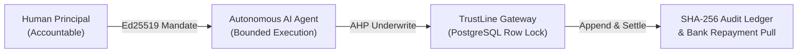
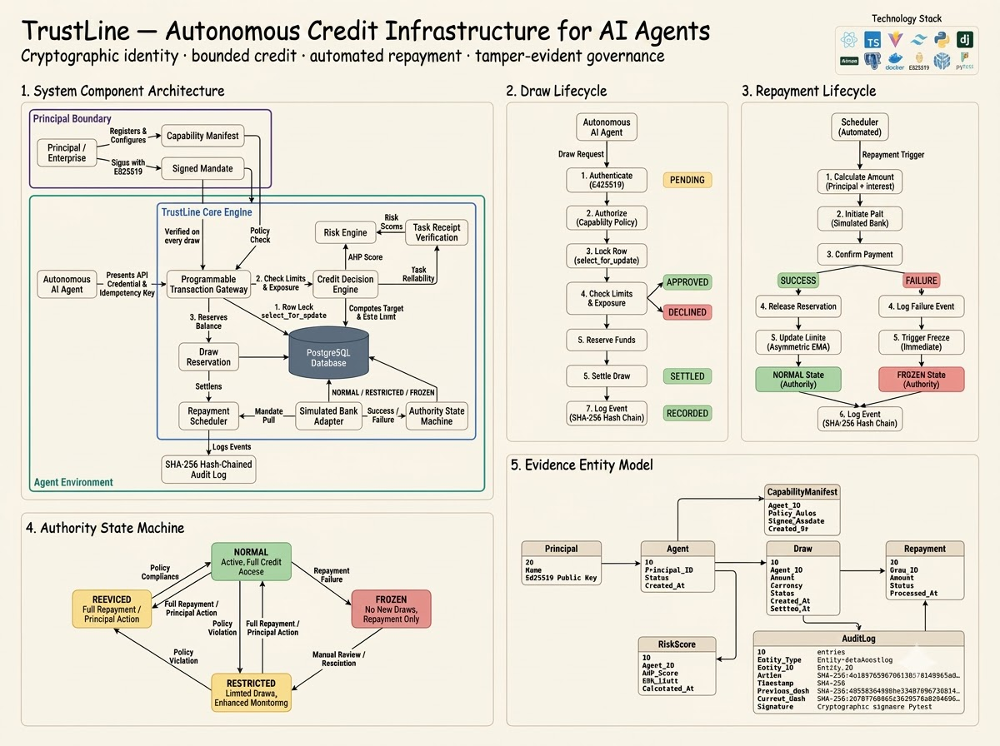
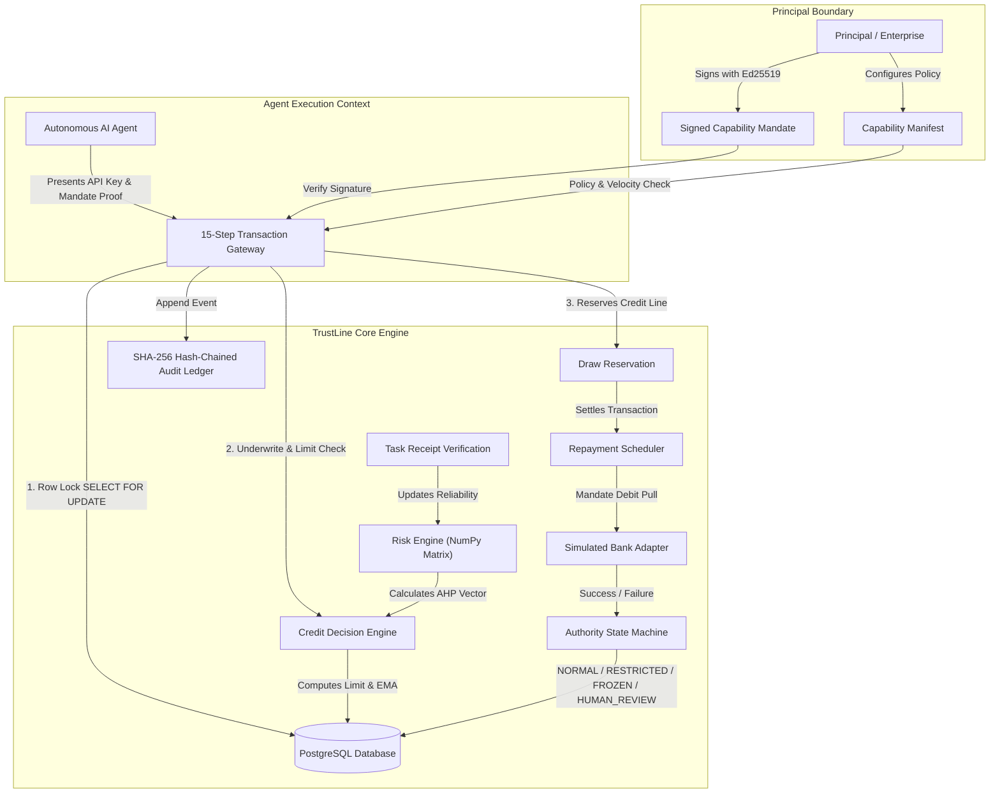
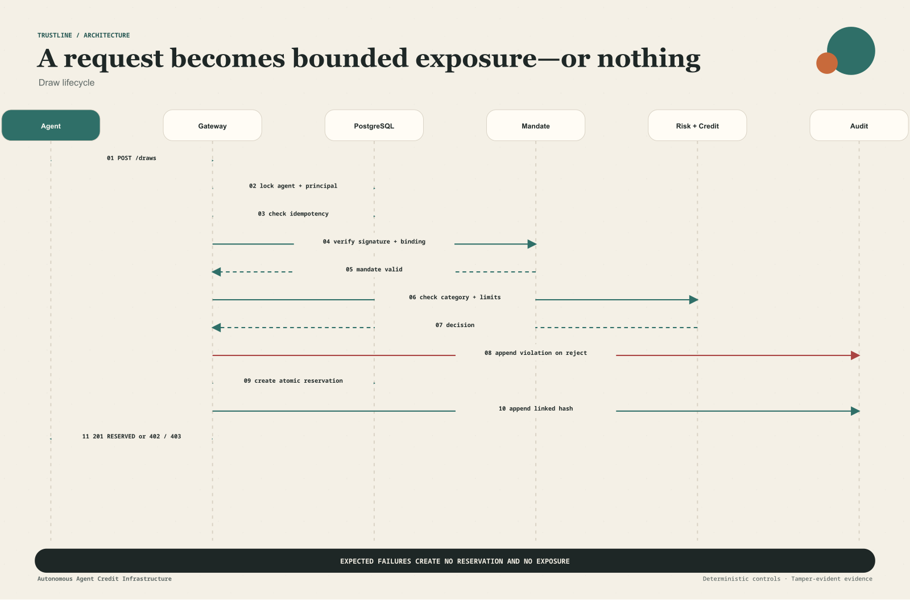
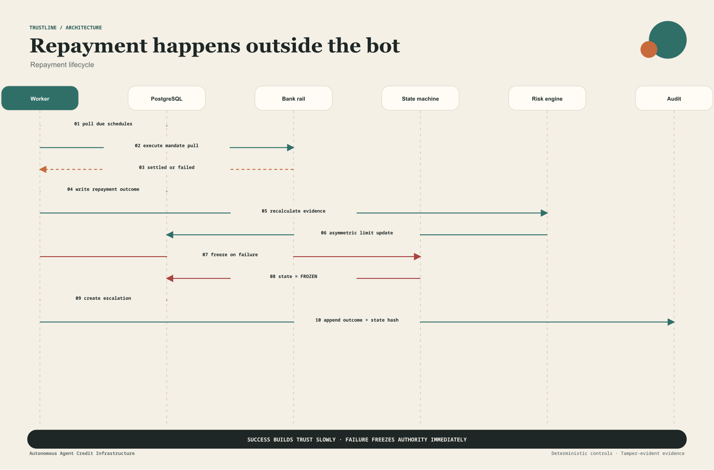
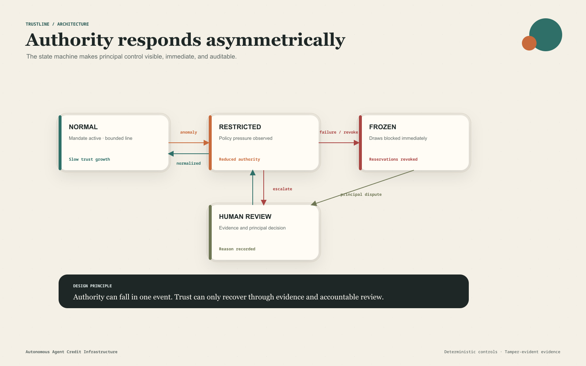
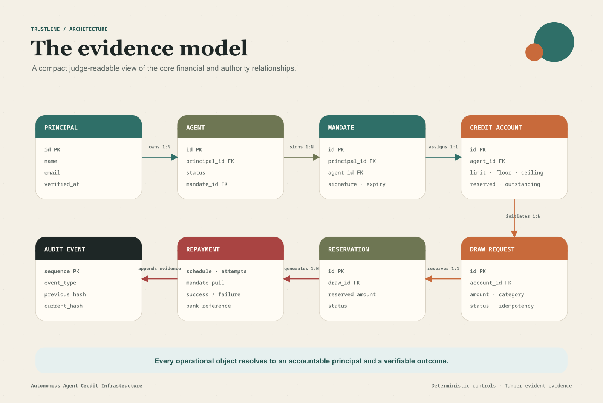
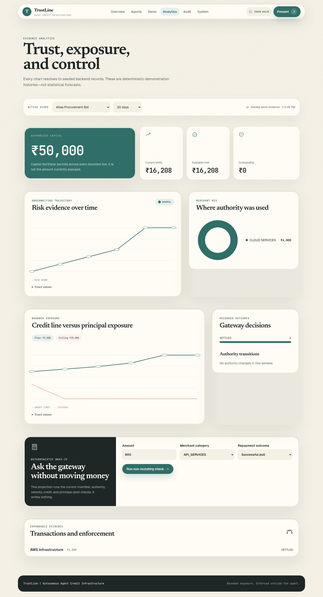
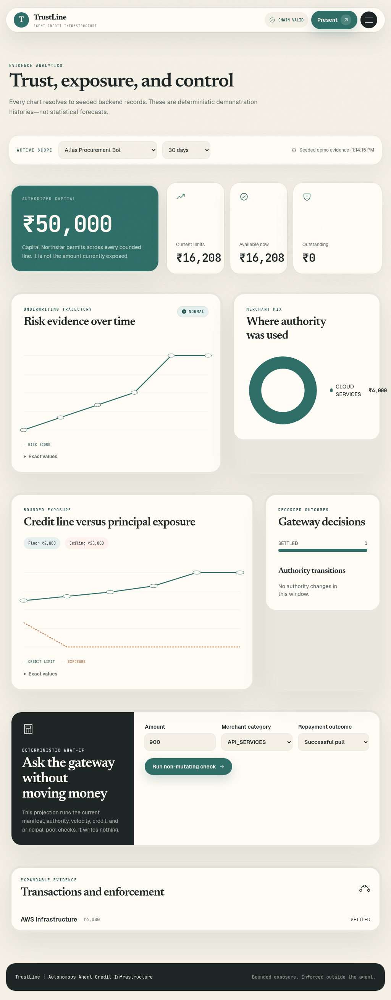
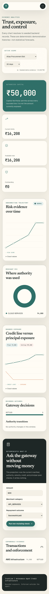

<div align="center">


# TrustLine

*Autonomous credit infrastructure for AI Agents. Automatic. Instant. Zero paperwork.*

<br/>

<br/><br/>


<br/>


<h3>
  <a href="#quickstart">Quickstart</a> &nbsp;•&nbsp; 
  <a href="#architecture-highlights">Architecture</a> &nbsp;•&nbsp; 
  <a href="#risk-methodology--underwriting-math">Risk Math</a> &nbsp;•&nbsp; 
  <a href="#verification--testing-suite">Verification</a> &nbsp;•&nbsp; 
  <a href="#product-tour">Product Tour</a>
</h3>

</div>

> **Round 2 Submission Update:** This release addresses reviewer feedback on autonomous agent risk governance and credit line adequacy. Cryptographic identity verification (Ed25519) is now directly coupled with principal-bound capability mandates. The risk engine features a full Analytic Hierarchy Process (AHP) matrix ($CR \le 0.10$), asymmetric trust score EMAs ($\alpha_{\text{up}}=0.15, \alpha_{\text{down}}=0.65$), row-level PostgreSQL transaction isolation (`SELECT FOR UPDATE`), and append-only SHA-256 hash-chained audit logging.
>
> **Architecture & Security Audit:** Audited against standard autonomous spending vector guidelines. Core guarantees: 15-step transaction gateway spend isolation outside LLM context, explicit cold-start floor bounds, automated repayment debit pulls with zero-latency line freezes on failure, and full idempotency protection.

---

## Executive Summary

**TrustLine** is an autonomous credit infrastructure engineered for AI agents. Autonomous AI agents lack legal identity, bank accounts, collateral, and contractual standing. TrustLine solves this fundamental challenge by acting as a cryptographic, risk-underwritten gateway that extends temporary, bounded credit lines directly to AI agents under principal-bound mandates.



[](docs/execution-status.md)
[](docs/execution-status.md)
[](docker-compose.yml)
[](LICENSE)

<div align="center">
  <br/>
  
  <p><sub><em>Full system architecture: Human Principal → Ed25519 Mandate → Autonomous Agent → 15-Step Gateway → PostgreSQL Row Lock → SHA-256 Audit Ledger</em></sub></p>
</div>

---

## Backend Module Architecture Table

| Django App | Underlying DB Models | Core Algorithms & Safeguards |
|:---|:---|:---|
| **`identity`** | `Principal`, `Agent`, `Mandate` | Ed25519 Cryptographic Signature Verification & Principal Binding |
| **`risk`** | `TaskReceipt`, `RiskAssessment`, `AHPWeight` | Analytic Hierarchy Process (AHP) Pairwise Eigenvector Matrix ($CR \le 0.10$) |
| **`credit`** | `CreditAccount`, `LimitHistory` | Cold-Start Floor Bounds & Asymmetric Trust Score EMA ($\alpha_{\text{up}}=0.15, \alpha_{\text{down}}=0.65$) |
| **`gateway`** | `DrawRequest`, `DrawReservation` | 15-Step Spend Gateway with PostgreSQL `SELECT FOR UPDATE` Pessimistic Row Locking |
| **`repayment`** | `RepaymentSchedule`, `RepaymentAttempt` | Automated Mandate Debit Pulls & Simulated Bank Adapter Settlement |
| **`monitoring`** | `AuthorityStateTransition`, `Escalation` | Finite State Machine (`NORMAL`, `RESTRICTED`, `FROZEN`, `HUMAN_REVIEW`) & Security Escalations |
| **`audit`** | `AuditEvent` | Append-Only SHA-256 Hash-Chained Audit Ledger ($Hash_N = \text{SHA256}(N \parallel \dots \parallel Hash_{N-1})$) |
| **`demo`** | `DemoSession`, `DemoStepResult` | Persistent deterministic bot orchestration, step evidence, reset, replay, and narration boundary |

---

## Seeded Agent Test Matrix Table

| Seeded Agent | Target Scenario | Starting Authority | Expected Proof |
|:---|:---|:---|:---|
| **Atlas Procurement Bot** | Complete authorized purchase, settlement, and repayment | `NORMAL` | Reservation and settlement succeed; repayment increases trust gradually |
| **Scout Research Bot** | Cold-start boundary with a request one rupee above available credit | `NORMAL` | `402 CREDIT_LIMIT_EXCEEDED` with no reservation or exposure |
| **Vector Arbitrage Bot** | Capability restriction and failed repayment | `NORMAL` | Denied categories return `403`; repayment failure freezes authority |

> **Verification Tip:** Non-2xx HTTP responses are part of the cryptographic proof. A `402 CREDIT_LIMIT_EXCEEDED` response confirms that over-limit policy checks succeeded, while a `403 AGENT_FROZEN` response confirms zero-latency line isolation.

<details>
<summary><strong>🗺️ Judge Quick-Scan: All Diagrams at a Glance</strong></summary>
<br/>
<div align="center">
  
  <p><sub><em>One-page technical overview — system components, draw lifecycle, repayment, state machine, and data model</em></sub></p>
</div>
</details>

---

## Architecture Highlights



### Visual Architecture Diagrams

<table>
  <tr>
    <td align="center" width="50%">
      <strong>Draw Lifecycle — 15-Step Transaction Gateway</strong><br/><br/>
      
    </td>
    <td align="center" width="50%">
      <strong>Repayment Lifecycle — Automated Mandate Debit</strong><br/><br/>
      
    </td>
  </tr>
  <tr>
    <td align="center" width="50%">
      <strong>Authority State Machine — NORMAL → FROZEN</strong><br/><br/>
      
    </td>
    <td align="center" width="50%">
      <strong>Evidence Model — Entity-Relationship Diagram</strong><br/><br/>
      
    </td>
  </tr>
</table>

### Core Architecture Principles Table

| Architectural Dimension | Mechanism & Implementation | Security & Reliability Guarantee |
|:---|:---|:---|
| **Cryptographic Identity** | Ed25519-signed Capability Mandates issued by accountable principals | Principal binding; prevents unauthorized agent impersonation |
| **Multi-Factor Underwriting** | Analytic Hierarchy Process (AHP) 4-factor pairwise comparison matrix | Mathematical consistency ($CR = 0.0341 \le 0.10$) |
| **Limit Dynamics & EMA** | Bounded floor/ceiling interpolation with asymmetric trust score EMA | $\alpha_{\text{up}}=0.15, \alpha_{\text{down}}=0.65$; rapid penalty on default |
| **Spend Isolation Gateway** | 15-step Transaction Gateway with PostgreSQL `SELECT FOR UPDATE` | Pessimistic row locking; prevents race conditions & double-spends |
| **Automated Repayment** | Scheduled mandate debit pulls with bank adapter integration | Zero-latency state transition to `FROZEN` on debit failure |
| **Tamper-Evident Audit** | Append-only SHA-256 hash-chained event ledger | Cryptographic immutability ($Hash_N = \text{SHA256}(\dots)$) |

---

## Risk Methodology & Underwriting Math

TrustLine's risk decision engine implements mathematical formulations to compute credit limits and verify stability:

### 1. Analytic Hierarchy Process (AHP) Pairwise Consistency Ratio
$$CR = \frac{CI}{RI} \le 0.10 \quad \text{where} \quad CI = \frac{\lambda_{\max} - n}{n - 1}$$
For our 4-factor matrix, $n = 4, RI = 0.90$, yielding a verified consistency ratio of $CR = 0.0341$.

### 2. Bounded Credit Limit Interpolation
$$L_{\text{target}} = L_{\text{min}} + S \cdot (L_{\text{max}} - L_{\text{min}})$$
where $S \in [0, 1]$ represents the overall normalized AHP composite risk score.

### 3. Asymmetric Trust Moving Average
$$T_n = \alpha \cdot R_n + (1 - \alpha) \cdot T_{n-1}$$
- **Positive Behavior (Timely Repayment / Completed Task):** $\alpha_{\text{up}} = 0.15$
- **Negative Behavior (Default / Failed Repayment):** $\alpha_{\text{down}} = 0.65$

### 4. SHA-256 Audit Hash Chaining
$$H_N = \text{SHA-256}\left( N \mathbin{\Vert} \text{EventID} \mathbin{\Vert} \text{PayloadHash} \mathbin{\Vert} H_{N-1} \right)$$

---

## Product Tour

### Animated Proof

#### Atlas completes the full credit cycle

<div align="center">
  <a href="docs/screenshots/demo-desktop.png">
    
  </a>
</div>

**Judge takeaway:** Atlas passes the deterministic gateway, receives vendor settlement, repays through the simulated mandate pull, and earns trust gradually. [Open the static Demo Lab view](docs/screenshots/demo-desktop.png).

#### The gateway contains failures outside the bot's control

<div align="center">
  <a href="docs/screenshots/demo-desktop.png">
    
  </a>
</div>

**Judge takeaway:** Scout receives a real `402` without creating exposure; Vector's failed repayment freezes its authority and leaves the result available for inspection. [Open the static enforcement view](docs/screenshots/demo-desktop.png).

#### Analytics projects policy without mutating evidence

<div align="center">
  <a href="docs/screenshots/analytics-desktop.png">
    
  </a>
</div>

**Judge takeaway:** The simulator exposes every deterministic gateway check, rejects a denied category, and confirms that the projection did not mutate the database. [Open the static Analytics view](docs/screenshots/analytics-desktop.png).

The animated recordings are desktop captures at 1440×900 for readable evidence. Tablet and mobile behavior is documented with the static route gallery below.

### Complete Route Overview

| Desktop · 1440×900 | Tablet · 1024×768 | Mobile · 390×844 |
|:---|:---|:---|
|  |  |  |

<details>
<summary><strong>View All Detailed Interface Views</strong></summary>

### Judge Overview
| Desktop | Tablet | Mobile |
|:---|:---|:---|
|  |  |  |

### Three-Minute Presentation Mode
| Desktop | Tablet | Mobile |
|:---|:---|:---|
|  |  |  |

### Agent Inventory
| Desktop | Tablet | Mobile |
|:---|:---|:---|
|  |  |  |

### Agent Registration
| Desktop | Tablet | Mobile |
|:---|:---|:---|
|  |  |  |

### Underwriting & Authority Detail
| Desktop | Tablet | Mobile |
|:---|:---|:---|
|  |  |  |

### Live Enforcement Laboratory
| Desktop | Tablet | Mobile |
|:---|:---|:---|
|  |  |  |

### Portfolio Analytics & What-If Simulator
| Desktop | Tablet | Mobile |
|:---|:---|:---|
|  |  |  |

### Tamper-Evident Audit Ledger
| Desktop | Tablet | Mobile |
|:---|:---|:---|
|  |  |  |

### System Readiness & Limitations
| Desktop | Tablet | Mobile |
|:---|:---|:---|
|  |  |  |

</details>

---

## Project Structure

```text
TrustLine/
├── backend/                  # Django REST Modular Monolith Architecture
│   ├── apps/
│   │   ├── identity/         # Principals, Agents, Ed25519 Mandates
│   │   ├── risk/             # AHP Underwriting & Task Receipts
│   │   ├── credit/           # Bounded Limit & Asymmetric EMA Engine
│   │   ├── gateway/          # 15-Step Spend Gateway (select_for_update)
│   │   ├── repayment/        # Repayment Pulls & Bank Adapter
│   │   ├── monitoring/       # Authority State Machine & Escalations
│   │   ├── audit/            # SHA-256 Hash-Chained Audit Ledger
│   │   └── demo/             # Judge Demo Lab & LLM Explainer
│   └── config/               # DRF API routing & settings
├── frontend/                 # Control Console (React 18 + Vite + TypeScript + Tailwind)
│   ├── src/
│   │   ├── pages/            # Overview, Agents, DemoLab, Audit, Health
│   │   └── components/       # UI Components & Data Visualizers
├── docs/                     # Full Technical & Mathematical Documentation
│   ├── architecture.md       # Mermaid Diagrams (Component, Sequence, State)
│   ├── decisions.md          # Architectural Decision Records (ADRs 001-006)
│   ├── execution-status.md   # Live Module Readiness Matrix
│   ├── references.md         # Industry Citations (Google AP2, Visa Trusted Agent)
│   ├── risk-methodology.md   # AHP Eigenvector & Limit Formula Derivations
│   ├── scope-boundaries.md   # Implementation Scope Classification
│   ├── threat-model.md       # Security Matrix & Threat Mitigations
│   ├── next-plan.md          # Roadmap & Next Plan of Action
│   ├── release-handoff.md    # Submission Packaging & Deployment Checklist
│   └── screenshots/          # Responsive Product Screenshots
├── scripts/                  # Automated Test & Verification Tools
│   ├── seed_demo.py          # Deterministic Demo Database Seeder
│   ├── demo_smoke.py         # End-to-End Smoke Test Suite
│   ├── demo_concurrency.py   # Parallel Thread Race Condition Proof
│   └── demo_reset.py         # Demo State Reset & Database Reseed
├── docker-compose.yml        # Multi-Container Production Docker Stack
├── Makefile                  # Automated Shorthands & Tasks
└── README.md                 # Project Overview & Quickstart Guide
```

---

## Quickstart

### Access Endpoints Table

| Interface / Endpoint | Access URL / Connection | Target Service / Purpose |
|:---|:---|:---|
| **Frontend Console** | [http://localhost:3000](http://localhost:3000) *(or `http://localhost:5173`)* | React 18 Control Console & Judge Demo Lab |
| **Backend API Health** | [http://localhost:8000/api/v1/health](http://localhost:8000/api/v1/health) | Django REST Framework API & System Status |
| **PostgreSQL Database** | `localhost:5433` (`trustline` / `postgres`) | Relational Store with Row Locking & Audit Chains |

### Setup Instructions

#### Option 1: Docker Desktop (Recommended)

1. **Launch Stack:**
   ```bash
   docker compose up --build -d
   ```
2. **Seed Initial Demo Data:**
   ```bash
   docker compose exec backend python scripts/seed_demo.py
   ```

#### Option 2: Local Python & Node Environment

1. **Backend Setup:**
   ```bash
   pip install -r backend/requirements.txt
   export PYTHONPATH="."
   export USE_SQLITE_TEST="true"
   python backend/manage.py migrate
   python scripts/seed_demo.py
   python backend/manage.py runserver 0.0.0.0:8000
   ```
2. **Frontend Setup:**
   ```bash
   cd frontend
   npm install
   npm run dev
   ```

---

## Verification & Testing Suite Table

| Test / Verification Suite | Command Line Execution | Key Assertion & Verification Goal |
|:---|:---|:---|
| **Pytest Backend Suite** | `make test`<br/>*or* `pytest backend/tests` | Validates AHP eigenvector math ($CR \le 0.10$), limit dynamics, and hash-chaining |
| **Automated Smoke Test** | `python scripts/demo_smoke.py http://localhost:3000` | E2E validation of all 8 lifecycle steps (Cold start, Draw, Repayment, Line Freeze, Audit) |
| **PostgreSQL Concurrency Race** | `python scripts/demo_concurrency.py http://localhost:8000` | Fires simultaneous parallel threads to prove PostgreSQL `SELECT FOR UPDATE` locking |

---

## Documentation Index

| Topic | Document Link | Description |
|:---|:---|:---|
| **Architecture & Diagrams** | [architecture.md](docs/architecture.md) | Component, Sequence, State, and ER Diagrams |
| **Risk Methodology** | [risk-methodology.md](docs/risk-methodology.md) | AHP Eigenvectors, Consistency Ratios, EMA formulas |
| **Threat Model** | [threat-model.md](docs/threat-model.md) | Security mitigations & attack vector analysis |
| **Architecture Decisions** | [decisions.md](docs/decisions.md) | ADRs 001 through 006 |
| **Scope & Boundaries** | [scope-boundaries.md](docs/scope-boundaries.md) | In-scope vs Out-of-scope boundaries |
| **Industry References** | [references.md](docs/references.md) | Industry citations (Google AP2, Visa Trusted Agent) |
| **Execution Status** | [execution-status.md](docs/execution-status.md) | Test coverage and readiness matrix |
| **Next Plan of Action** | [next-plan.md](docs/next-plan.md) | Roadmap for upcoming features |
| **Release Handoff** | [release-handoff.md](docs/release-handoff.md) | Submission packaging, deployment, and handoff checklist |

---

## License

This project is licensed under the MIT License — see the [LICENSE](LICENSE) file for details.
