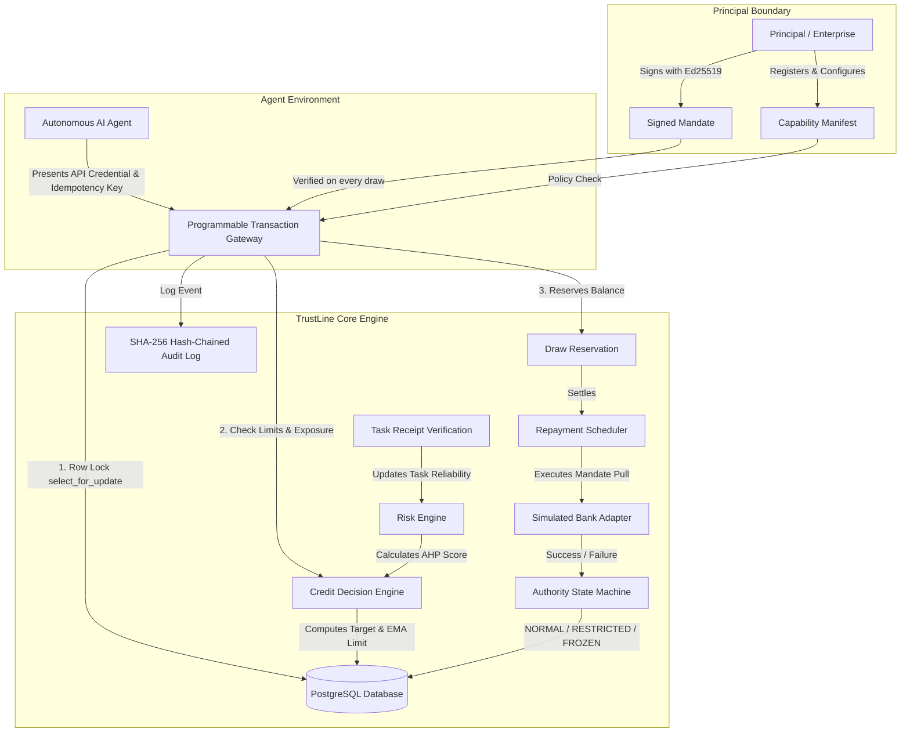
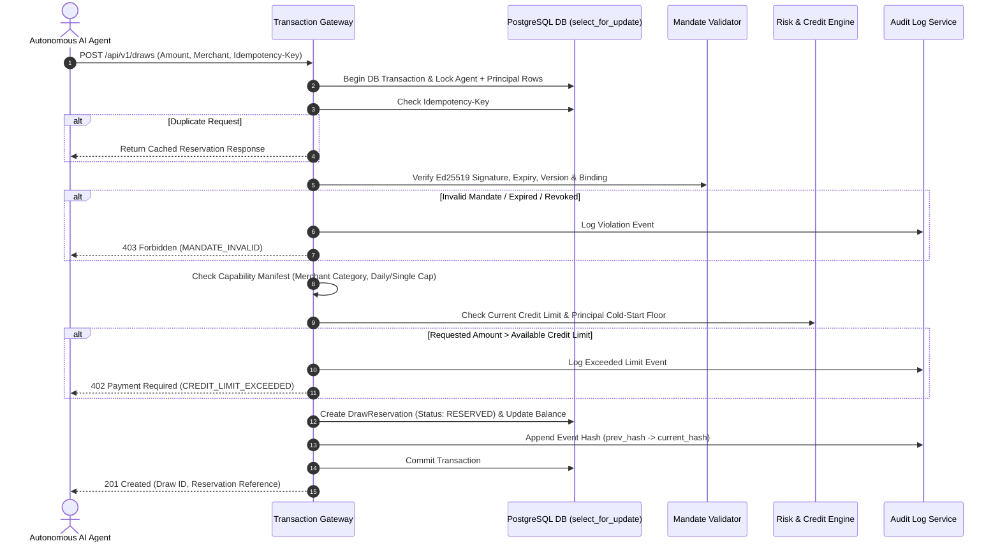
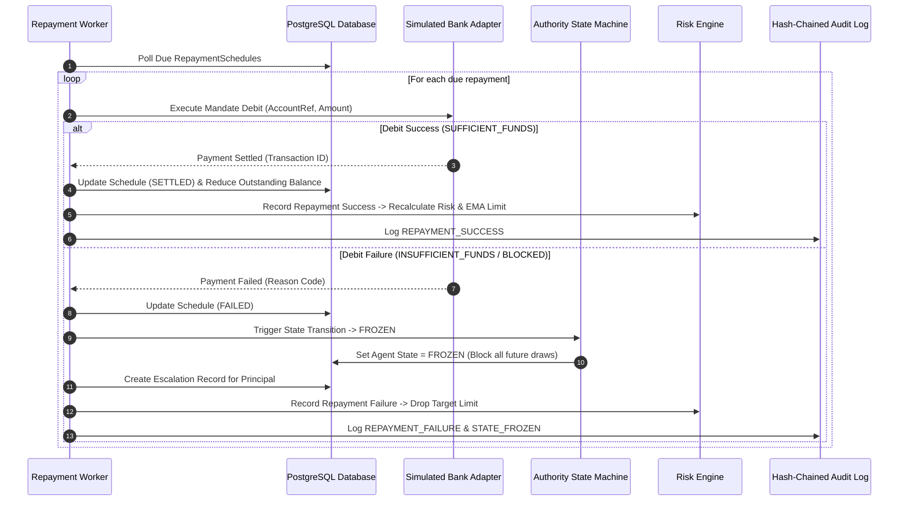
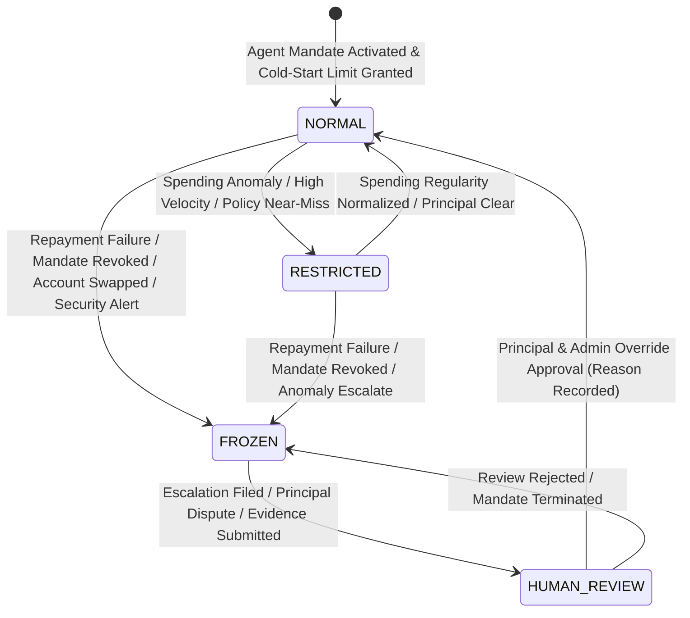
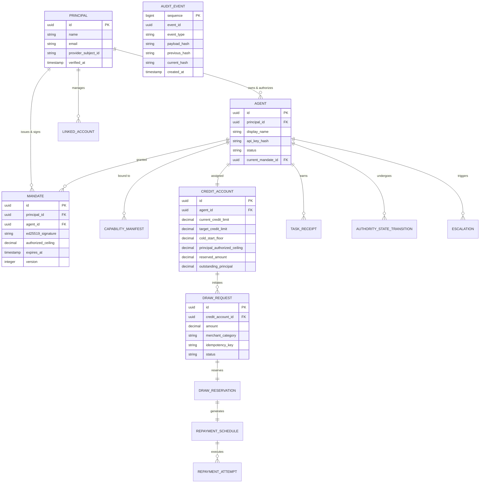

# TrustLine Architecture Documentation

## System Component Diagram

---

## Draw Lifecycle Sequence Diagram

---

## Repayment Sequence Diagram

---

## Authority State Machine Diagram

---

## Entity-Relationship (ER) Diagram

